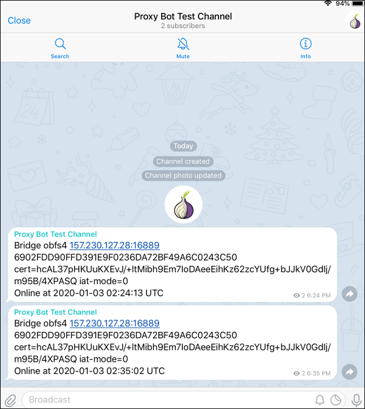

# proxybot

Proxybot checks the connectivity of servers and displays the results on Telegram chat.

## Screenshot



## Install MariaDB

```
sudo apt update
sudo apt upgrade

sudo apt install mariadb-server

sudo mysql_secure_installation
```

## Install Python Packages

```
sudo apt install python3-pip

pip3 install PyMySQL

pip3 install python-dotenv

pip3 install pytz

pip3 install python-telegram-bot
```

## Clone Scripts from Github

```
sudo apt install git

git clone https://github.com/sigvids/proxybot.git
```

## Create Database, Table, and User

Edit `create.sql` and replace the default database password with your desired database password. Then issue the commands:

```
cd proxybot

sudo mysql -u root

source create.sql

quit
```

## Create New Bot

Start a chat with @BotFather. Use the /newbot command to create a new bot. The BotFather will ask you for a name and a username. The username must be globally unique and has to end with bot or Bot. 

The BotFather then generates an authorization token for your new bot. Keep your authorization token safe and secure. It can be used by anyone to control your bot.

Once the bot is created, you can add a description, about info, and profile picture with the respective commands:

* `/setdescription`
* `/setabouttext`
* `/setuserpic`

## Create Channel

Create a channel and add a name, description, and photo.

Determine the chat ID of the channel by prefixing `-100` to the first part of the parameter in its URL.

Make your bot an administrator of the channel.

## Create Environment Variables

Copy the example file:

```
cp example.env .env
```

Edit the `.env` file to contain your database password, your authorization token, and your channel chat ID.

```
vi .env
```

## Schedule Script

Edit your `crontab` to run the script according to your desired schedule.

```
crontab -e
```

There is a sample `crontab` line in the repository in a file named `crontab.txt`.
